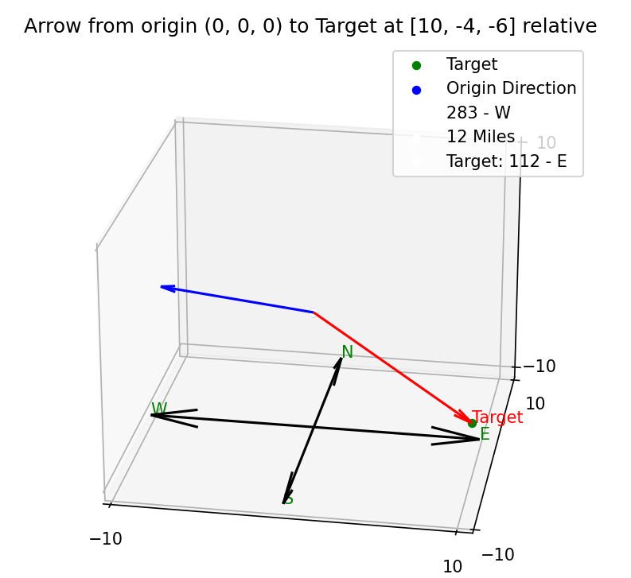

# Geospatial Intelligence


## Ownership and Licensing

This document was authored by [Gilbert Garczynski](https://github.com/ggarcz1) and is the intellectual property of the author. 

The content is made publicly available on GitHub to promote open collaboration and knowledge sharing. By accessing or using this document, you agree to the terms outlined below:


- **License**: This work is licensed under a Creative Commons Attribution-NonCommercial 4.0 International License. [Link to License](https://creativecommons.org/licenses/by-nc/4.0/)
- **Copyright Notice**: © 2024 Gilbert Garczynski. All rights reserved.

## Disclaimer

This document is provided for educational and ethical purposes only. Unauthorized or malicious use of the techniques described is strictly prohibited. The author assumes no responsibility for any misuse of this material.

### Attribution
If you use or reference any items within this document, please provide proper attribution to the original author.


End goal inspiration/follow along:

[](https://www.youtube.com/watch?v=rm_ZL623Lzg )

*For Developers*

To generate required libraries, run the following:
- `pip install pipreqs`
- `pipreqs . --force`

To install required libraries:
- `pip install -r requirements.txt`

A repository of geospatial intelligence projects, code, and algorithms

Coordinates can be defined via the following:

```python
from coords import Coords
# 2D
point1 = Coords(39.48719569273062, -76.53854508092664, None)
point2 = Coords(39.48886062760044, -76.52274732566815, None)
print(Coords.rise_run(point1, point2, None))
# 3D
point3 = Coords(39.48886062760044, -76.52274732566815, 534)
```

Random coordinates can be defined via the following:

```python
from random_coordinates import Random_Coordinates
Random_coordinates.get_2d()
Random_coordinates.get_3d()
```
Utilize the following imports for the associated methods below:

```python
from physics_methods import Physics
Physics.speed(...)
Physics.velocity(...)
Physics.acceleration(...)
```

Space is defined as 50 miles in the US and 62 miles internationally.
- `50` miles (`80.65` km) = `264000` feet (`80650` meters) 
- `62` miles (`100` km) = `327360` feet (`100000` meters)

### 3D Coordinates ###

Input values are in miles.  To view the target and object in 3d space, run:
- `python .\3d_space.py -x 10 -y 13 -z 14 -d 83`
  - `-x` --> x point of target
  - `-y` --> y point of target
  - `-z` --> z point of target
  - `-d` --> direction of origin`

For default hardcoded values, run:
- `python .\3d_space.py`



### ToDo: ###

1. In `coods.py` figure out if the 'none' is valid check for the `z` parameter in coordinates.  This may cayse issues with 2D vs 3D point verifications.

  - What about 1D points?

  - Could possibly add a check for the dimension type to the coords class

See issue at : <https://github.com/ggarcz1/Geospatial-Intelligence/issues/7>

2. Tracking and vectoring.  See issues below:
   - <https://github.com/ggarcz1/Geospatial-Intelligence/issues/5>
   - <https://github.com/ggarcz1/Geospatial-Intelligence/issues/6>


  